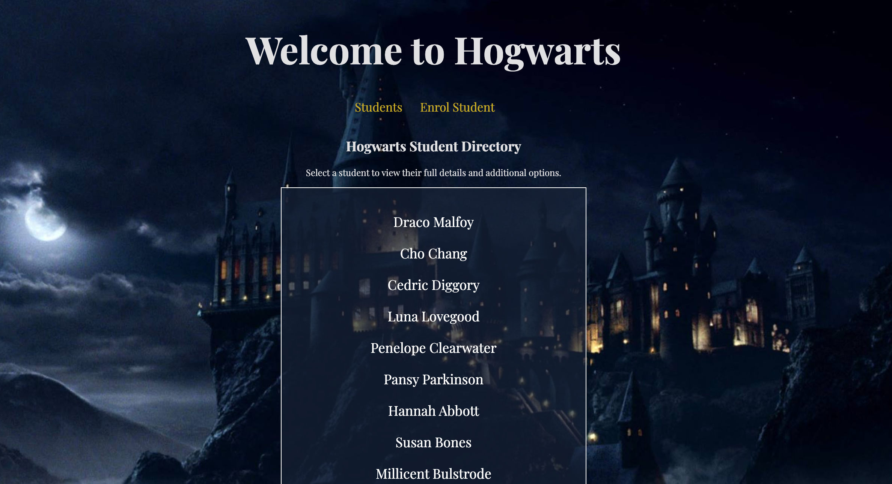
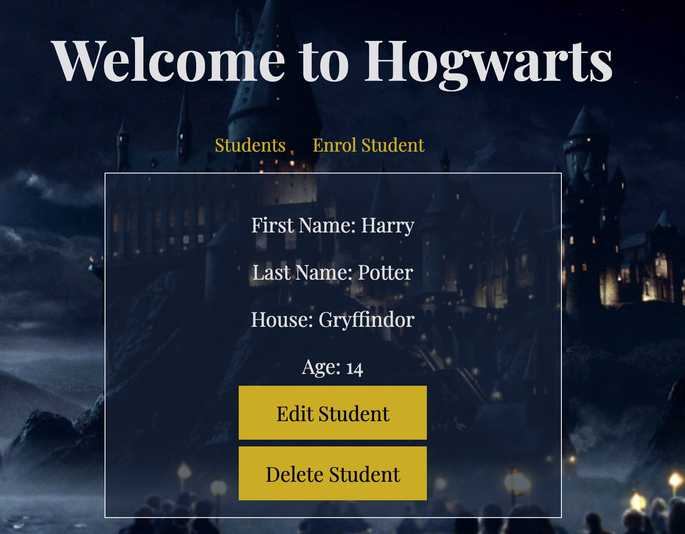
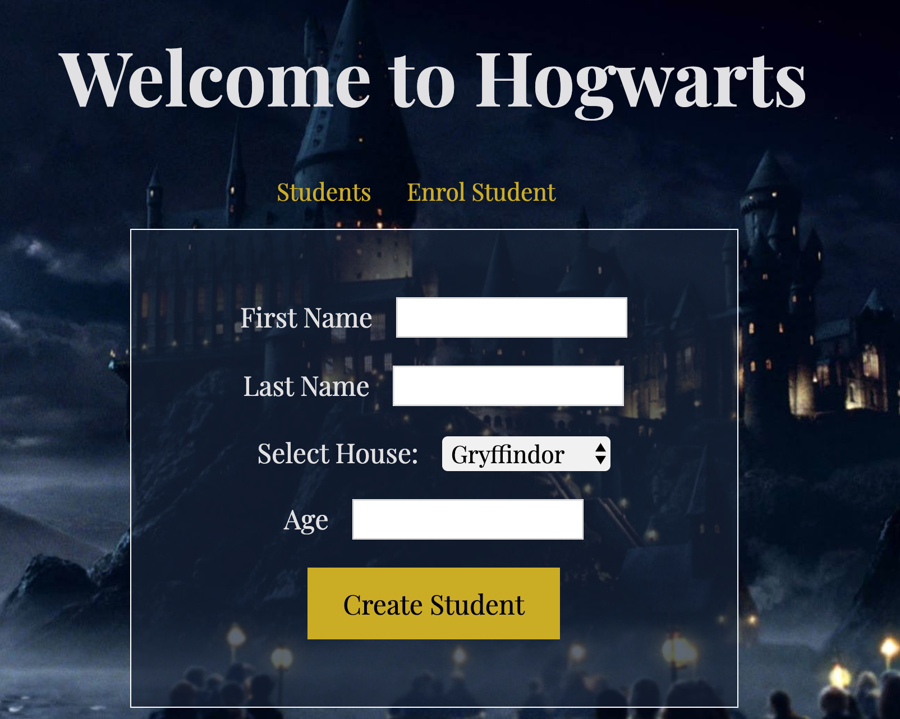

# Hogwarts Lab

This project was completed during my time studying at CodeClan. This was a 2 hour lab to learn Sinatra, SQL and MVC.

The subject was Hogwarts and having a postgreSQL database of students, with CRUD actions.

The project can be viewed at: http://jmm-ruby-school-lab.herokuapp.com/students

Student List:

View Student Details:

Create Student:

## Approach:
- Seed database and work through RESTful routes to firstly get the data and then gradually build up each route to be able to add / update / delete.
- Following the lab, I did some additional CSS work to make it more presentable. Hogwarts was a fun topic for me so I enjoyed styling it up a bit!
- I also deployed the app to Heroku.

## Challenges and Learnings:
- Learning how to manipulate the :id params in the controller in order to edit a specific student was a key learning point for me, and I found the lab a useful exercise for practicing my understanding of this.
- The other main challenge was getting used to embedded ruby in the view files, and applying "if" statements when editing a student and selecting a House (as there are only ever 4 specific houses in Hogwarts).

## The Brief:

We've given you a starting point with all your models / sql / seeds pre-written (you lucky things!)
Don't forget to create your db, create the tables, seed your db!

#### MVP
- Add the RESTful routes for the students resource into the students controller
- - GET - '/students'	- index action - index page to display all students
- - GET - '/students/new' - new action - displays create student form                        
- - GET - '/students/:id' - show action - displays one student based on ID in the url
- - POST - '/students' - create action - creates one student
- - GET - '/students/:id/edit' - edit action - displays edit form based on ID in the url
- - POST - '/students/:id' - update action - replaces an existing student based on ID in the url
- - POST - '/students/:id/delete' - destroy action - deletes one student based on ID in the url
- Add the corresponding views

## Run:
- Requires sinatra
- Run: ruby students_controller.rb
- Loads in localhost/students
